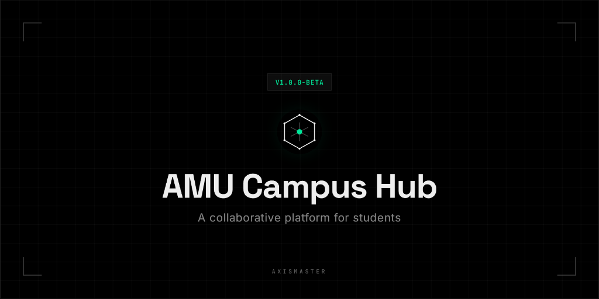

<div align="center">
  
  
  # 🎓 AMU Campus Hub
  **The ultimate student-led companion for Aligarh Muslim University.**
  
  [](https://nextjs.org/)
  [](https://supabase.com/)
  [](https://tailwindcss.com/)
  [](https://www.typescriptlang.org/)
</div>

---

## 🏗️ About the Project

**AMU Campus Hub** is a centralized platform designed specifically for students of Aligarh Muslim University. It solves the fragmentation of information by providing a unified interface for campus life—from academic events and cultural fests to official university notices.

> [!NOTE]
> This is a **student-led initiative** and is not an official product of Aligarh Muslim University.

## ✨ Key Features

- **📅 Event Management**: Explore, filter, and save upcoming campus events. Sort by Academic, Cultural, Sports, or Hall categories.
- **📄 Official Notices**: Real-time access to official notices from the university portal without the clutter.
- **🛡️ Admin Panel**: Verified student organizers and admins can upload and manage events.
- **👤 Student Profiles**: Personal accounts to track saved events and receive notifications.
- **🌑 Premium Design**: Built with a sleek, OLED-focused dark theme and micro-animations for a premium feel.

## 🛠️ Tech Stack

- **Framework**: [Next.js 15+](https://nextjs.org/) (App Router)
- **Database & Auth**: [Supabase](https://supabase.com/)
- **Styling**: [Tailwind CSS](https://tailwindcss.com/)
- **Icons**: [Lucide React](https://lucide.dev/)
- **Animations**: [Motion](https://motion.dev/)
- **Language**: [TypeScript](https://www.typescriptlang.org/)

## 🚀 Getting Started

### Prerequisites

- [Node.js](https://nodejs.org/) (v18.x or later)
- [npm](https://www.npmjs.com/) or [yarn](https://yarnpkg.com/)
- A [Supabase](https://supabase.com/) account for database and authentication.

### Local Installation

1. **Clone the repository:**
   ```bash
   git clone https://github.com/AxisMaster/AMU-Campus-Hub.git
   cd AMU-Campus-Hub
   ```

2. **Install dependencies:**
   ```bash
   npm install
   ```

3. **Set up Environment Variables:**
   Create a `.env.local` file in the root directory and add your Supabase credentials securely:
   ```bash
   touch .env.local
   ```
   *Note: Ensure `NEXT_PUBLIC_SUPABASE_URL` and `NEXT_PUBLIC_SUPABASE_ANON_KEY` are correctly set.*

4. **Initialize Database:**
   Run the SQL scripts provided in `supabase-setup-auth.sql` and `supabase-setup-notifications.sql` in your Supabase SQL editor to create the necessary tables and RLS policies.

5. **Run the development server:**
   ```bash
   npm run dev
   ```
   Open [http://localhost:3000](http://localhost:3000) to see the app!

## 📂 Project Structure

```bash
├── app/             # Next.js App Router (Pages & API)
├── components/      # Reusable UI components
├── context/         # Auth and Global State
├── hooks/           # Custom React hooks
├── lib/             # Utilities and Supabase client
├── public/          # Static assets
├── types/           # TypeScript definitions
└── brain/           # Implementation artifacts
```

## 🤝 Contributing

We welcome contributions! If you're an AMU student and want to improve the campus hub:
1. Fork the repo.
2. Create your feature branch (`git checkout -b feature/amazing-feature`).
3. Commit your changes (`git commit -m 'Add some feature'`).
4. Push to the branch (`git push origin feature/amazing-feature`).
5. Open a Pull Request.

## 📜 License

Distributed under the MIT License. See `LICENSE` for more information (if applicable).

---
<div align="center">
  MADE BY STUDENTS, FOR STUDENTS.
</div>
